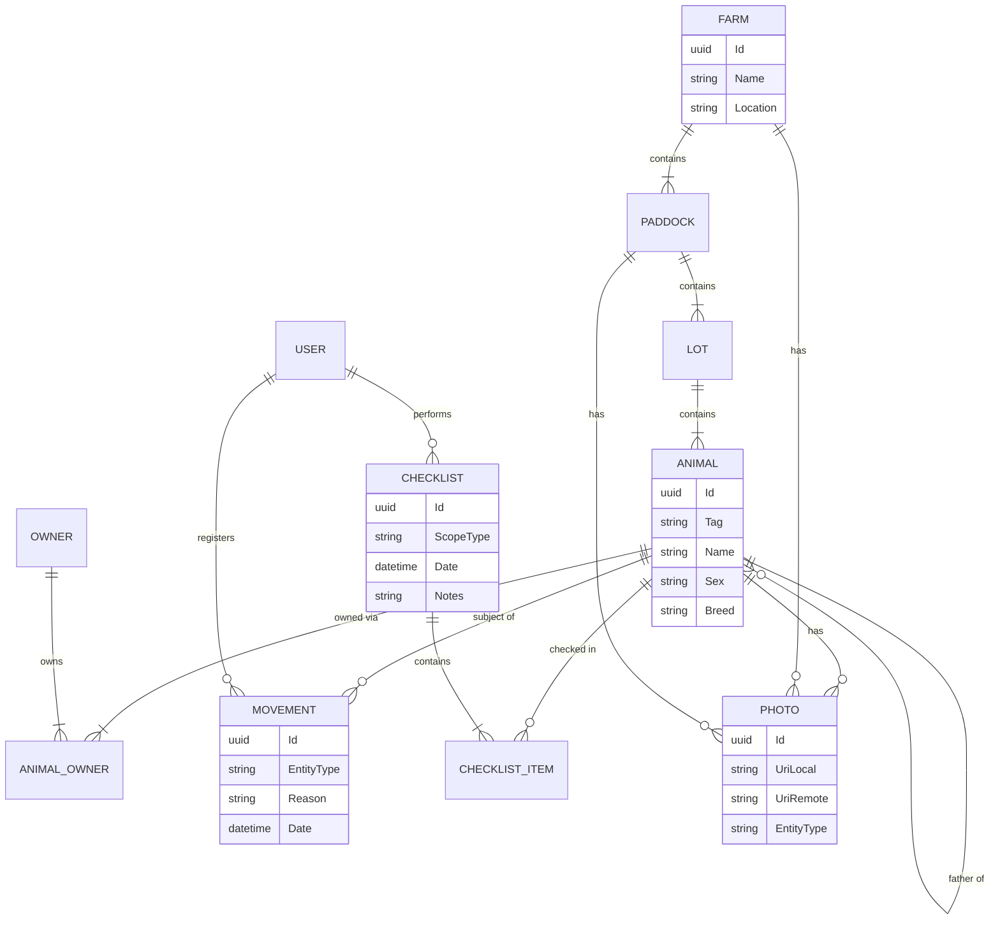

# AgroLink System Architecture

This document defines the high-level architecture, data design, and component interactions for the AgroLink system.

## 1. System Context Diagram (C4 Level 1)

This diagram represents the high-level context of the AgroLink system, showing how users interact with the system and its external dependencies.

```mermaid
graph TD
    User[User / Farmer]
    
    subgraph AgroLink_System [AgroLink System]
        API[AgroLink API]
    end
    
    subgraph External_Systems [External Infrastructure]
        Auth[Identity Provider / JWT]
        S3[Object Storage\n(AWS S3 / MinIO)]
        Email[Email Service]
    end

    User -->|Manage Farms, Animals, Checklists| API
    API -->|Stores Photos| S3
    API -->|Authenticates| Auth
    API -->|Sends Notifications| Email
```

## 2. Container Architecture (C4 Level 2)

This diagram shows the high-level technology choices and how containers interact within the local/production environment.

```mermaid
graph TB
    Client[Client App\n(Web / Mobile)]
    
    subgraph Docker_Host [Container Environment]
        API[AgroLink API\n(.NET 8)]
        DB[(PostgreSQL\nDatabase)]
        MinIO[(MinIO / S3\nObject Storage)]
    end

    Client -->|HTTPS / JSON| API
    API -->|EF Core / SQL| DB
    API -->|AWS SDK| MinIO
    
    style API fill:#512bd4,stroke:#333,stroke-width:2px,color:white
    style DB fill:#336791,stroke:#333,stroke-width:2px,color:white
    style MinIO fill:#c72c48,stroke:#333,stroke-width:2px,color:white
```

## 3. Component Design: Clean Architecture & CQRS

The application follows strict Clean Architecture principles with a CQRS (Command Query Responsibility Segregation) pattern using MediatR.

```mermaid
flowchart LR
    subgraph Presentation [API Layer]
        Controller[Controllers]
    end

    subgraph Application [Application Layer]
        DTO[DTOs]
        Mediator[MediatR Pipeline]
        Validation[Behaviors / Validators]
        Handler[Command/Query Handlers]
        Interface[Interfaces]
    end

    subgraph Domain [Domain Layer]
        Entity[Entities]
        ValueObj[Value Objects]
        DomainEvent[Domain Events]
    end

    subgraph Infrastructure [Infrastructure Layer]
        RepoImpl[Repository Implementation]
        S3Impl[AWS S3 Service]
        DbContext[AgroLink DbContext]
    end

    Controller -->|Send Command/Query| Mediator
    Mediator -->|Pipeline| Validation
    Validation --> Handler
    Handler -->|Uses| Interface
    Handler -->|Manipulates| Entity
    
    RepoImpl ..|>|Implements| Interface
    S3Impl ..|>|Implements| Interface
    
    RepoImpl -->|Uses| DbContext
    DbContext -->|Maps| Entity
```

## 4. Entity Relationship Diagram (ERD)

Derived from `AgroLinkDbContext` and Domain Entities.


