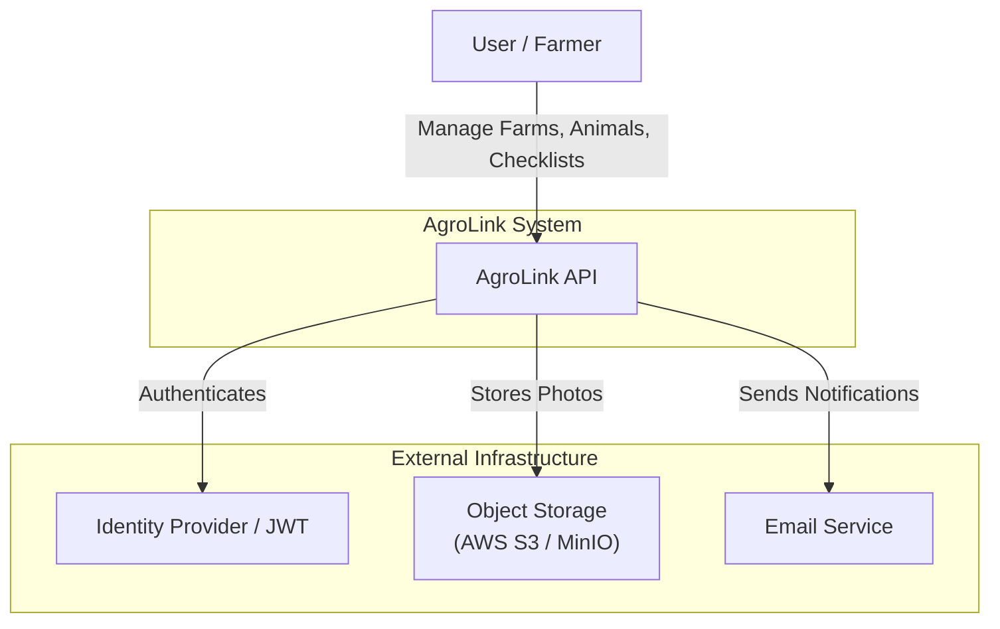
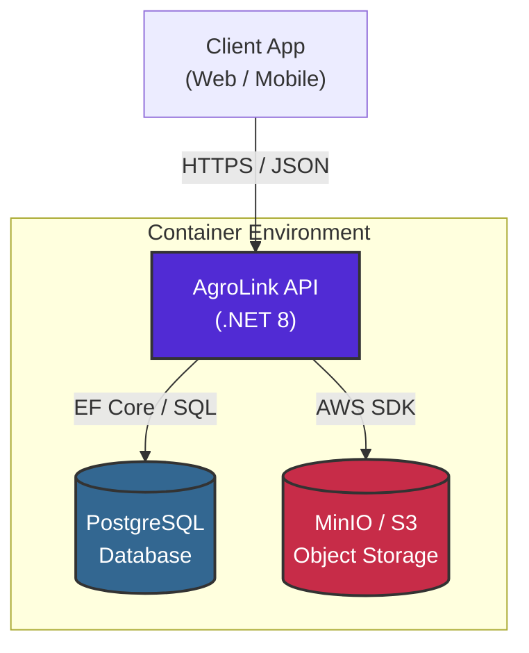
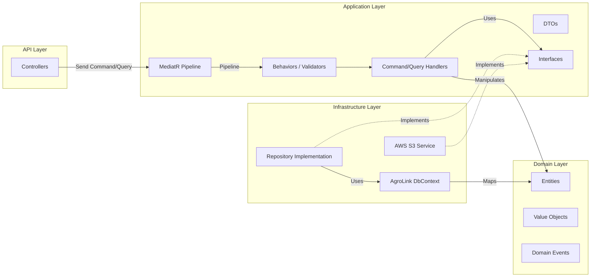
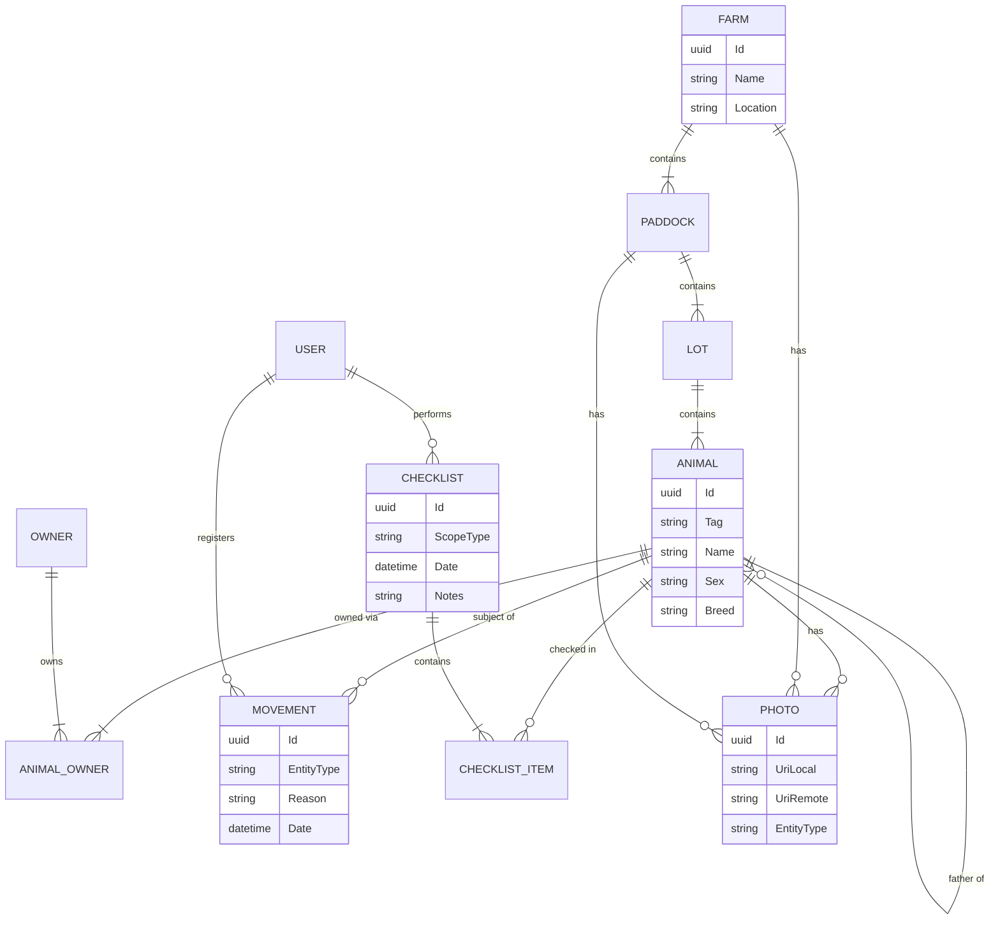
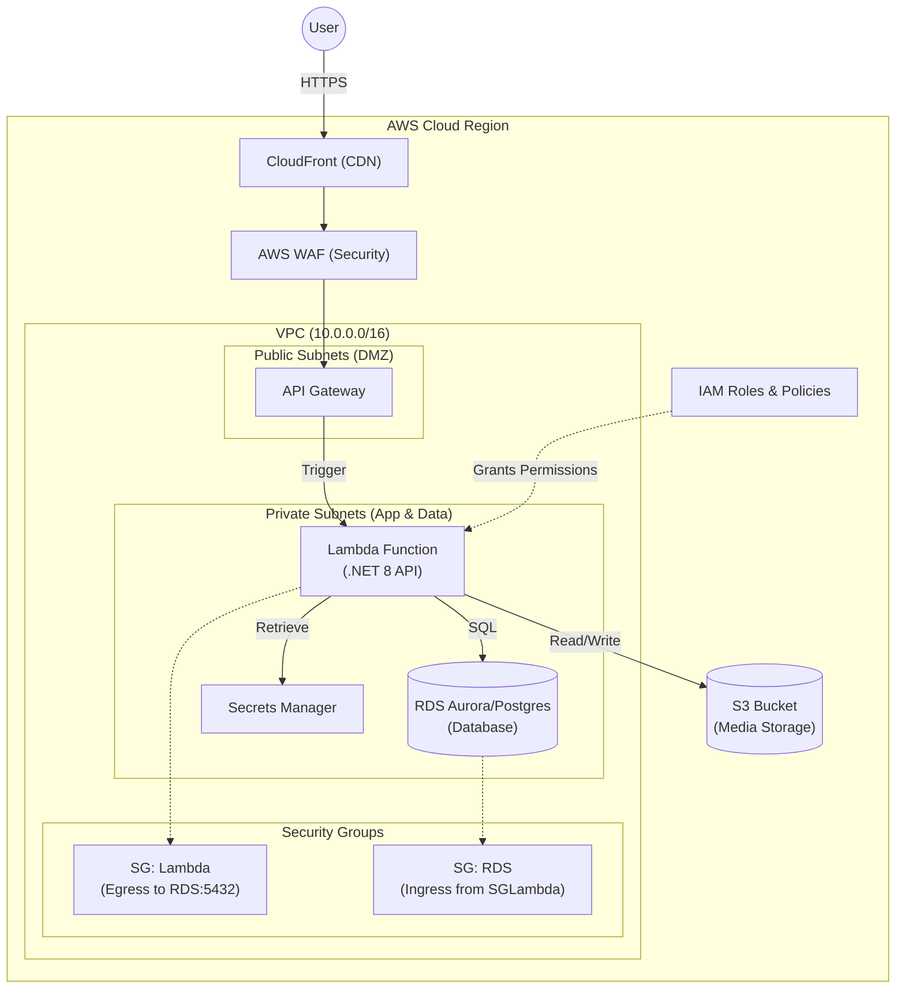

# AgroLink System Architecture

This document defines the high-level architecture, data design, and component interactions for the AgroLink system.

## Index

1. [System Context Diagram (C4 Level 1)](#1-system-context-diagram-c4-level-1)
2. [Container Architecture (C4 Level 2)](#2-container-architecture-c4-level-2)
3. [Component Design: Clean Architecture & CQRS](#3-component-design-clean-architecture--cqrs)
4. [Entity Relationship Diagram (ERD)](#4-entity-relationship-diagram-erd)
5. [Infrastructure / Deployment Diagram](#5-infrastructure--deployment-diagram)

## 1. System Context Diagram (C4 Level 1) 

This diagram represents the high-level context of the AgroLink system, showing how users interact with the system and its external dependencies.

## 2. Container Architecture (C4 Level 2)

This diagram shows the high-level technology choices and how containers interact within the local/production environment.

## 3. Component Design: Clean Architecture & CQRS

The application follows strict Clean Architecture principles with a CQRS (Command Query Responsibility Segregation) pattern using MediatR.

## 4. Entity Relationship Diagram (ERD)

Derived from `AgroLinkDbContext` and Domain Entities.

## 5. Infrastructure / Deployment Diagram

This diagram visualizes the actual AWS resources and their connectivity, serving as the blueprint for Terraform scripts. It illustrates the network isolation and security boundaries.

### Key Infrastructure Components:

- **VPC Structure:** Highly available multi-AZ setup with Public Subnets for ingress (API Gateway) and Private Subnets for computing (Lambda) and data (RDS).
- **Security Groups:** 
    - `SGLambda`: Restricts outbound traffic only to required services (RDS, S3 endpoint).
    - `SGRDS`: Only allows inbound traffic on port 5432 from the Lambda's Security Group.
- **Identity & Access:** IAM Roles use the principle of least privilege, granting the Lambda function access only to specific S3 buckets and Secrets Manager keys.
- **Edge Security:** CloudFront combined with AWS WAF provides DDoS protection and global content delivery for static assets or API endpoints.